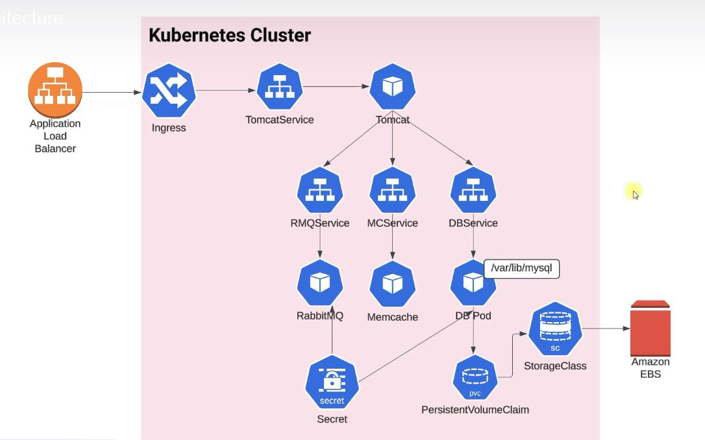
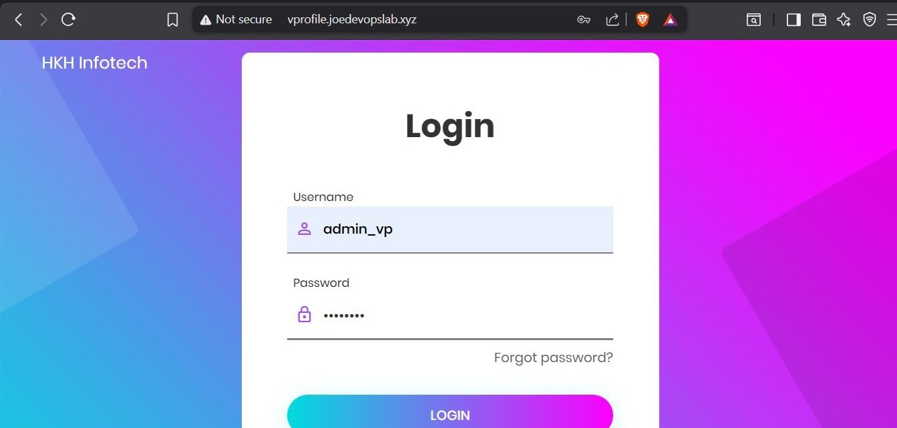
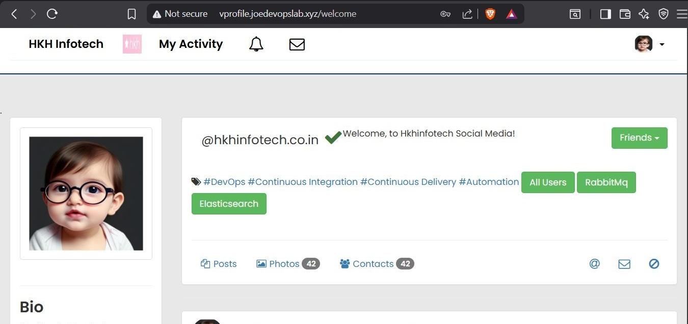
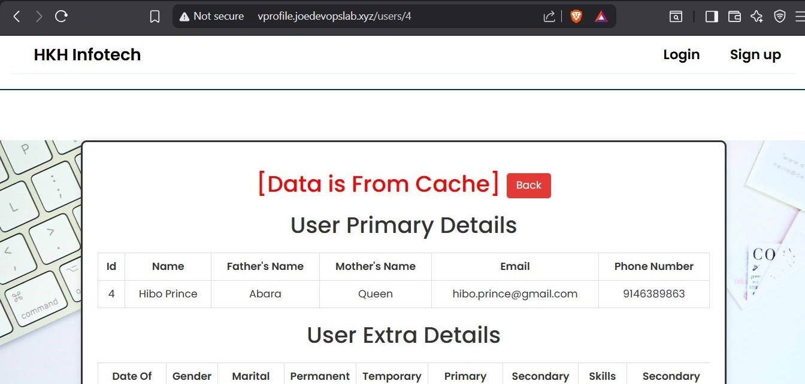
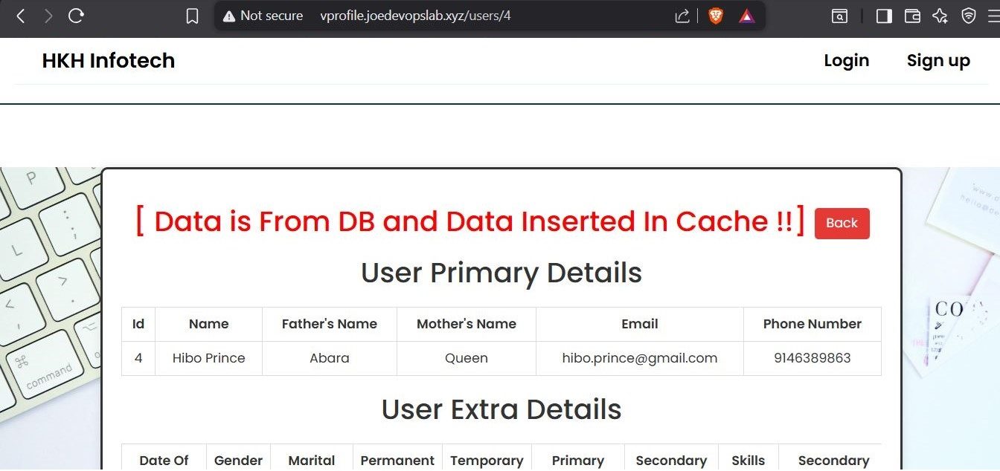
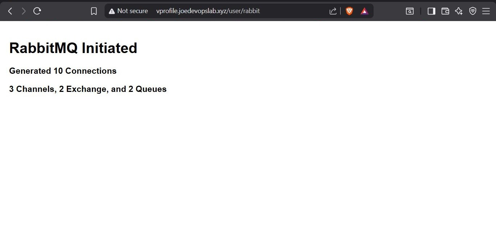
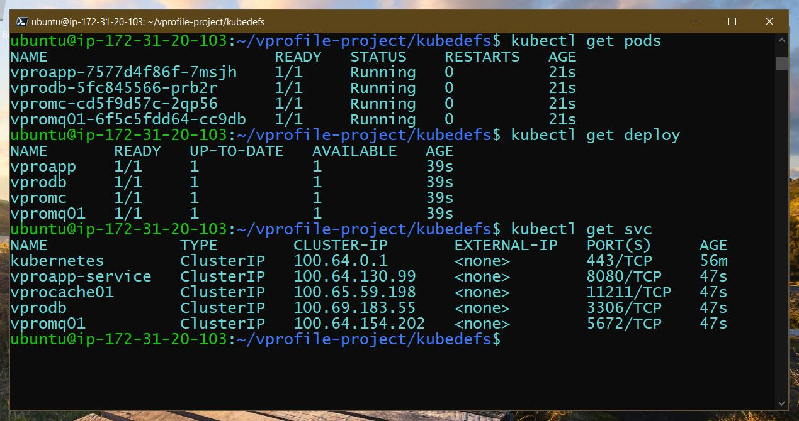
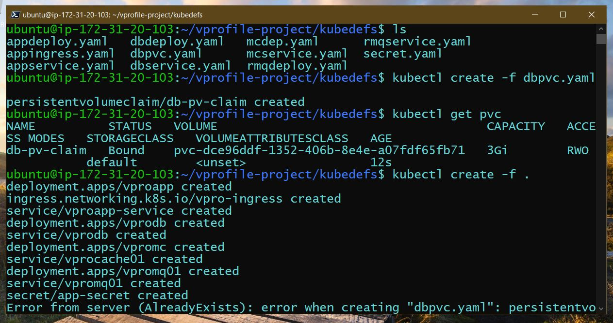
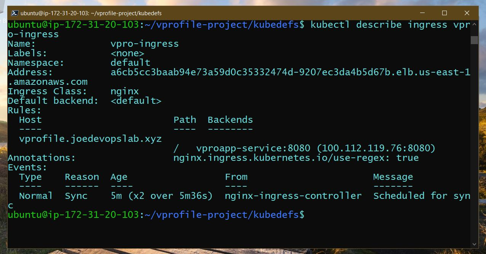

# VProfile Application Deployment on Kubernetes (AWS EKS / Self-Managed Cluster)


## 📌 Project Overview
This project demonstrates deploying the **VProfile Java Microservices Application** into a Kubernetes cluster using Infrastructure-as-Code and Kubernetes manifests.

The goal of this project is to showcase **container orchestration, persistent storage management, service discovery, secrets management, and ingress-based routing** in a production-like DevOps setup.

> All screenshots and kubectl outputs were captured from a live Kubernetes cluster deployed on AWS.

---

## 🏗 Architecture

### High Level Flow
```
Application Load Balancer
↓
Ingress
↓
Tomcat Service
↓
Backend Services (MySQL, RabbitMQ, Memcached)
```
### Architecture Diagram



### Components
- Kubernetes Cluster
- Ingress Controller
- Tomcat Application Service
- RabbitMQ Message Broker
- Memcached Caching Layer
- MySQL Database with Persistent Storage
- Kubernetes Secrets
- Storage Class with AWS EBS

---

## 🧰 Technology Stack

| Category | Tools |
|-----------|------------|
| Containerization | Docker |
| Orchestration | Kubernetes |
| Cloud Provider | AWS |
| Storage | AWS EBS |
| Messaging | RabbitMQ |
| Cache | Memcached |
| Database | MySQL |
| CI/CD (Optional Extension) | GitHub Actions / Jenkins |
| IaC (Optional Extension) | Terraform / Kops |

---

## 📂 Repository Structure

```
vprofile-kubernetes-deployment/
│
├── kubernetes-manifests/
│   ├── appdeploy.yaml
│   ├── appingress.yaml
│   ├── appservice.yaml
│   ├── dbdeploy.yaml
│   ├── dbpvc.yaml
│   ├── dbservice.yaml
│   ├── mcdeploy.yaml
│   ├── mcservice.yaml
│   ├── rmqdeploy.yaml
│   ├── rmqservice.yaml
│   └── secret.yaml
│
├── docs/
│   ├── architecture/
│   │   └── vprofile-k8s-architecture.png
│   │
│   ├── screenshots/
│   │   ├── application/
│   │   │   ├── login-page.png
│   │   │   ├── home-page.png
│   │   │   ├── cache-hit.png
│   │   │   ├── cache-miss.png
│   │   │   └── rabbitmq-init.png
│   │   │
│   │   └── kubernetes/
│   │       ├── pods-services.png
│   │       ├── deployments-created.png
│   │       └── ingress-details.png
│   │
│   ├── deployment-guide.md
│   ├── architecture.md
│   └── troubleshooting.md
│
└── README.md

```

---

## 🚀 Deployment Workflow

### Step 1: Setup Kubernetes Cluster
- Provision cluster using Kops / EKS
- Configure kubectl access

### Step 2: Create Storage Resources
- StorageClass
- PersistentVolumeClaim

### Step 3: Deploy Backend Services
- MySQL Database
- RabbitMQ
- Memcached

### Step 4: Deploy Application Layer
- Tomcat Application
- Service Resources

### Step 5: Configure Networking
- Ingress Controller
- Load Balancer

---

## 🔐 Secrets Management
Sensitive data like database credentials are stored securely using Kubernetes Secrets.

---

## 💾 Persistent Storage
MySQL uses:
- PersistentVolumeClaim
- AWS Elastic Block Storage

---

## 🚀 Deployment Steps

```bash
# 1️⃣ Create Persistent Volume Claim
kubectl apply -f kubernetes-manifests/dbpvc.yaml

# 2️⃣ Deploy Backend Services
kubectl apply -f kubernetes-manifests/dbdeploy.yaml
kubectl apply -f kubernetes-manifests/dbservice.yaml

kubectl apply -f kubernetes-manifests/mcdeploy.yaml
kubectl apply -f kubernetes-manifests/mcservice.yaml

kubectl apply -f kubernetes-manifests/rmqdeploy.yaml
kubectl apply -f kubernetes-manifests/rmqservice.yaml

# 3️⃣ Deploy Application Layer
kubectl apply -f kubernetes-manifests/appdeploy.yaml
kubectl apply -f kubernetes-manifests/appservice.yaml

# 4️⃣ Configure Ingress
kubectl apply -f kubernetes-manifests/appingress.yaml

```
---
## 🔍 Verify Deployment

```bash
kubectl get pods
kubectl get svc
kubectl get ingress
kubectl get pvc
```
---

## 📺 Application Demo

### Login Page


### Home Page


### Cache Hit


### Cache Miss


### RabbitMQ Initialization


## ☸ Kubernetes Deployment Proof

### Pods & Services


### Deployments


### Ingress Details

---
## 🧹 Cleanup

```bash
kubectl delete -f kubernetes-manifests/
```
---

## 📊 Key DevOps Skills Demonstrated
- Multi-tier application deployment on Kubernetes
- Stateful workloads using PersistentVolumeClaims
- Ingress-based routing with NGINX
- Service-to-service communication
- Secret management
- AWS EBS storage integration
- DNS configuration for production-style access

---

## ⭐Why This Project Matters

This project demonstrates production-grade Kubernetes deployment patterns including:

- Stateful service deployment
- Storage orchestration
- Multi-tier application architecture
- Secure configuration handling
- Cloud-native scalability

---

## 📈 Future Enhancements
- Helm Chart Packaging
- GitOps using ArgoCD
- Monitoring using Prometheus & Grafana
- Automated CI/CD Pipelines

---

## 👨‍💻 Author

DevOps Engineer Portfolio Project

AWS | Docker | Kubernetes | Cloud Infrastructure


